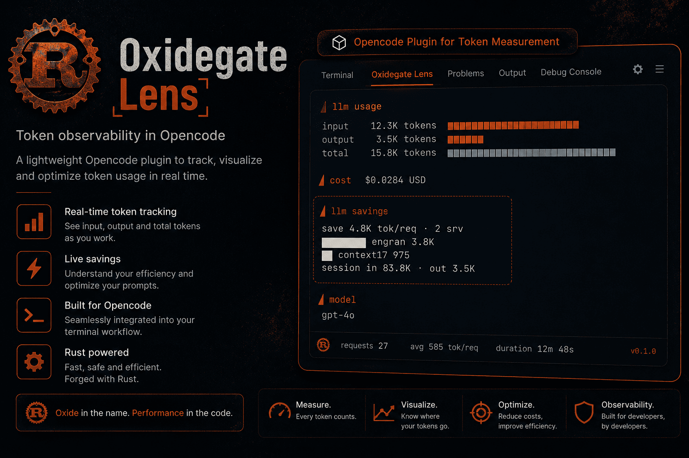

# oxidegate-lens

Muestra **cuántos bytes pesa cada servidor MCP en cada petición**. Lee esos datos de
[OxideGate](https://github.com/pichu2707/OxideGate) (un proxy local en Rust);
**nunca mide nada por su cuenta**. Tampoco concluye por qué falta un byte — sólo
muestra los hechos que sí puede medir, por separado, sin mezclarlos.

---

## Instalación

```sh
brew install pichu2707/tap/oxidegate-lens
```

Instala un comando: **`oxidegate-savings`** (el reporte). Cero dependencias:
solo necesita Node.

Y necesita a [OxideGate](https://github.com/pichu2707/OxideGate) corriendo, que es
quien mide:

```sh
brew install pichu2707/tap/oxidegate
```

---

## Empieza aquí

Un solo camino, cuatro pasos:

|       | Paso                                       | Comando / acción                                       |
| ----- | ------------------------------------------ | ------------------------------------------------------ |
| **1** | Enciende OxideGate                         | `OXIDEGATE_PORT=8899 oxidegate`                        |
| **2** | Apunta tu agente al proxy                  | `export ANTHROPIC_BASE_URL=http://127.0.0.1:8899`      |
| **3** | Úsalo un rato, y luego pide el reporte     | `OXIDEGATE_PORT=8899 oxidegate-savings`                |
| **4** | Lee la tabla                               | ↓ es exactamente lo que vas a ver                      |

> **`ANTHROPIC_BASE_URL` va SIN `/v1`.** El cliente añade la ruta él mismo. Si le
> pones el `/v1`, la petición sale a `/v1/v1/messages` y el proxy responde **404**.

> **No uses el puerto por defecto (8080)**: lo suelen tener ocupado Apache, Tomcat
> y compañía. Fija otro con `OXIDEGATE_PORT` — aquí usamos 8899 — y usa **ese
> mismo número** en todos los pasos. Si apuntas a un puerto donde vive otro
> servicio, el reporte te lo dice: *«responde, pero no es OxideGate»*.

> **El paso 3 no es opcional.** OxideGate solo puede medir lo que ha visto pasar.
> Si pides el reporte sin haber hecho ninguna petición a través del proxy, la
> tabla sale vacía — y eso no es un fallo, es que no hay nada que medir todavía.

El reporte imprime **tres bloques independientes, nunca mezclados en un solo
veredicto**, más un aviso:

1. **La tabla** — bytes. Cada servidor `mcp` que aparece ahí ya está en el body:
   sus bytes viajaron, punto. `sí, desconectándolo` sin excepción, sin importar
   `deferred_tools` ni quién dice ser el cliente.
2. **Disponibles vs. llegados** — una resta, sin causa. Cuántos servidores MCP
   tienes disponibles (`claude mcp list`, en tu propia máquina) contra cuántos
   llegaron al cable en esta petición. Si faltan, los nombra y ahí se detiene:
   no elige entre "tu harness los retiene" y "todavía no conectaron" — las dos
   son causas reales y una sola petición no alcanza para distinguirlas.
3. **Tokens de contexto** — otra moneda, aparte. Si el esquema, además de viajar
   en el body, también ocupa el contexto del modelo por adelantado
   (`deferred_tools`). Nunca cambia un byte de la tabla.

Ejemplo real, Claude Code hablando con Anthropic a través de OxideGate, con los
4 servidores MCP disponibles llegando los 4:

```
fuente: 2026-07-12T15:24:29.525525732+00:00  claude-opus-4-8-lens-case1  (anthropic)  cliente: claude-cli/2.1.207 (external, sdk-cli)

SERVIDOR                      KIND     TOOLS       BYTES   % TOOLS  ¿SE PUEDE QUITAR?
claude_ai_Google_Drive        mcp          1       161 B     25.2%  sí, desconectándolo
(native)                      native       2       158 B     24.7%  no, sólo con --tools
claude_ai_Google_Calendar     mcp          1       111 B     17.4%  sí, desconectándolo
plugin_engram_engram          mcp          1       111 B     17.4%  sí, desconectándolo
claude_ai_Gmail               mcp          1        91 B     14.2%  sí, desconectándolo
overhead (corchetes/comas)    -            -         7 B         -

ahorro por petición desconectando los 4 servidores MCP: 474 B (74.2% de los tools)

Tienes 4 servidor(es) MCP disponibles. En esta petición llegaron los 4.

tokens de contexto (otra moneda — NO bytes, no cambia nada de la tabla de arriba):
  - claude_ai_Google_Drive: ocupa el contexto completo por adelantado (0 tools diferidas)
  - claude_ai_Google_Calendar: ocupa el contexto completo por adelantado (0 tools diferidas)
  - plugin_engram_engram: ocupa el contexto completo por adelantado (0 tools diferidas)
  - claude_ai_Gmail: ocupa el contexto completo por adelantado (0 tools diferidas)

aviso: algunos harnesses (p. ej. Claude Code) difieren esquemas MCP por defecto, pero ese
diferido se cae a carga completa detrás de un ANTHROPIC_BASE_URL que no sea de Anthropic —
y OxideGate es exactamente eso. Si tu harness es de ese tipo, una parte de los bytes de
la tabla de arriba podría ser un artefacto de tener el proxy en el medio, no un costo que
exista sin él. Esta ejecución no lo puede decidir por ti: para comprobarlo, repite la misma
petición apuntando directo a Anthropic (sin pasar por OxideGate) y compara los bytes.
Detalle medido: docs/optimizer-tool-search.md §3 en el repo de OxideGate.
```

Y este es el caso donde algunos de los servidores disponibles **no llegaron al cable**
en esta petición puntual — el reporte lo dice como un hecho, sin adivinar la causa:

```
SERVIDOR                      KIND     TOOLS       BYTES   % TOOLS  ¿SE PUEDE QUITAR?
(native)                      native       2       158 B     62.5%  no, sólo con --tools
claude_ai_Gmail               mcp          1        91 B     36.0%  sí, desconectándolo
overhead (corchetes/comas)    -            -         4 B         -

ahorro por petición desconectando el servidor MCP: 91 B (36.0% de los tools)

Tienes 4 servidores MCP disponibles. En esta petición llegaron 1.
Los otros 3 (claude_ai_Google_Drive, claude_ai_Google_Calendar, plugin_engram_engram) no viajan ahora mismo.
Puede ser que tu harness los esté reteniendo, o que todavía no hayan conectado —
ninguna de las dos causas se puede confirmar desde esta sola petición (medido:
docs/optimizer-tool-search.md §3.1.4 en OxideGate).
```

**`¿SE PUEDE QUITAR?` nunca lee `deferred_tools` ni el header `client`.** Un tool
marcado con `defer_loading: true` sigue viajando ENTERO en el body — es un flag
sobre una definición que Anthropic necesita completa para poder buscarla, no un
recorte de esa definición. Diferido ahorra **contexto**, nunca **cable**
(detalle: `docs/optimizer-tool-search.md` §2.2 en el repo de OxideGate). Por eso
toda fila `mcp` en la tabla es siempre `sí, desconectándolo`, sin excepción: si
tiene fila, llegó al cable completa. Lo que puede haber, además, son servidores
disponibles que **no llegaron a tener fila** — eso es el bloque "disponibles vs.
llegados" de abajo de la tabla, nunca la columna.

Con un harness que carga los esquemas eager de verdad (OpenCode, por ejemplo), la misma
tabla y el mismo resumen de ahorro son igual de directos, sin ningún bloque extra —
ese dialecto no tiene primitivo de diferido, así que no hay nada que restar:

```
fuente: 2026-07-12T15:24:18.316600407+00:00  gpt-4o  (openai)  cliente: curl/8.21.0

SERVIDOR                      KIND     TOOLS       BYTES   % TOOLS  ¿SE PUEDE QUITAR?
claude_ai_Gmail               mcp          1       120 B     51.3%  sí, desconectándolo
(native)                      native       1       111 B     47.4%  no, sólo con --tools
overhead (corchetes/comas)    -            -         3 B         -

ahorro por petición desconectando el servidor MCP: 120 B (51.3% de los tools)
ya re-enviados en 1 petición observada: 120 B
Este dialecto (openai) no tiene primitivo de diferido: no existe una versión
donde estos bytes sean opcionales, para ningún harness. El costo de arriba es real,
sin ambigüedad — nada que decidir aquí.
```

> **Si la tabla sale vacía**, es por una de tres razones, en este orden:
> (1) OxideGate está apagado, (2) el puerto no es el que pusiste en `OXIDEGATE_PORT`,
> o (3) todavía no pasó ninguna petición **con MCP** por el proxy. No hay una cuarta.

Alternativa cómoda: ejecuta `npm link` una vez y después llama a `oxidegate-savings` desde
cualquier lado (en vez de `node bin/oxidegate-savings.mjs`).

### Qué significa cada columna

| Columna             | Qué es                                                                       |
| ------------------- | ----------------------------------------------------------------------------- |
| `SERVIDOR`          | El servidor que aporta esas herramientas (`(native)` es el propio agente).    |
| `KIND`              | `mcp` = servidor MCP conectado; `native` = superficie del agente.             |
| `TOOLS`             | Cuántas herramientas declara ese servidor.                                    |
| `BYTES`             | Cuánto pesan sus esquemas en el cuerpo de **cada** petición.                  |
| `% TOOLS`           | Qué porción del total de herramientas representa.                            |
| `¿SE PUEDE QUITAR?` | `mcp` → siempre `sí, desconectándolo`, sin excepción. `native` → siempre `no, sólo con --tools`. |

### Por qué `¿SE PUEDE QUITAR?` nunca depende de `deferred_tools` ni del `client`

Es tentador pensar que un servidor MCP con sus tools marcadas `defer_loading: true`
"ya pesa poco" en el body. **No es así, y confundir esas dos cosas es el error que
este reporte existe para no cometer.** `defer_loading` es un flag SOBRE una
definición de tool que Anthropic sigue necesitando completa en el body — `tool_search`
corre en el servidor de Anthropic y busca sobre las tools **declaradas en el
request**; si no están ahí, no hay nada que buscar. Diferido ahorra **contexto**
(lo que el modelo carga por adelantado), nunca **cable** (lo que viaja en cada
petición). Detalle medido: `docs/optimizer-tool-search.md` §2.2 y §3.2 en el repo
de OxideGate.

Tampoco depende del header `User-Agent` (`client`): es contenido que manda el
propio cliente, sin forma de verificarlo desde el servidor — cualquier proceso
puede mandar `claude-cli/...` sin serlo. Una versión anterior de este reporte
usaba ese header para decidir si hedgear una fila o una línea entera; siete
rondas de revisión adversarial encontraron, cada una, un caso real donde esa
inferencia se equivocaba. La corrección no fue una regla mejor: fue dejar de
inferir. Hoy el header sólo se imprime, informativo, en la línea `fuente:` de
arriba — nunca decide nada.

### Qué significa el bloque "disponibles vs. llegados"

Debajo de la tabla, cada ejecución de tráfico `anthropic` compara los servidores MCP
que tienes **disponibles** (`claude mcp list`, vía `lib/mcp-config.mjs`, corrido en tu
propia máquina) contra los que **llegaron** al cable (`tools_by_server`) para la
petición de la tabla de arriba. Es una resta, no una conclusión:

- **Coinciden** → lo dice y no agrega nada más.
- **Faltan algunos** → los nombra y explica que la ausencia tiene más de una causa
  posible (tu harness los está reteniendo, o todavía no terminaron de conectar) sin
  elegir cuál aplica — una sola petición no alcanza para saberlo (medido:
  `docs/optimizer-tool-search.md` §3.1.4, donde un conector remoto estuvo ausente en
  la petición #1 y presente, sin marcar, en la #3 siete segundos después, sin que
  nadie lo pidiera).
- **No se pudo leer tu configuración disponible** (`claude` no está en el PATH, el
  comando falló, se colgó, o su salida no tuvo el formato esperado) → lo dice
  explícitamente. Esto NUNCA se muestra igual que "0 servidores disponibles": son
  cosas distintas, y confundirlas fue exactamente el defecto que este reporte
  existe para no repetir (ver FAILURE POLICY en `lib/mcp-config.mjs`).
- **Dos nombres declarados colisionan al sanitizar** → `sanitizeServerName()`
  (`[^A-Za-z0-9_] → _`) NO es inyectiva: `"foo bar"` y `"foo_bar"` sanitizan
  ambos a `"foo_bar"`. Cuando eso pasa entre dos servidores **conectados**, no
  hay forma de saber, desde `tools_by_server`, a cuál de los dos corresponde
  una fila `foo_bar` que llegó — o si corresponde a ambos. El reporte nombra
  la colisión y saca esos dos nombres del conteo de disponibles/llegados en
  vez de adivinar o fusionarlos en silencio (medido: extrayendo la función
  real con ese par de nombres se obtenía antes `{ available: 1, missing: [] }`
  — un servidor entero desaparecía sin aviso).
- **La petición trae una fila `(others)`** → OxideGate solo trackea hasta 32
  servidores MCP distintos de forma individual por petición
  (`MAX_TOOL_SERVERS` en `src/provider/mod.rs`, OxideGate); el resto se sigue
  contando pero se funde en un único bucket sin nombre, `(others)`, en la
  tabla de arriba. Si algún servidor disponible no tiene fila propia Y la
  petición trae esa fila `(others)`, el reporte NO dice "no viajó": dice que
  no se puede confirmar si está adentro del bucket o si de verdad faltó —
  medido en vivo con 33 servidores donde el 33.º SÍ viajó (sus bytes están en
  `(others)`) y una versión anterior de este reporte igual decía que "no
  viaja ahora mismo".

Para tráfico de dialectos sin primitivo de diferido (`upstream !== "anthropic"`) este
bloque no aparece: no hay nada que restar, porque no existe una versión donde esos
bytes fueran opcionales para ningún harness.

### El aviso, y por qué no es una columna ni una línea de veredicto

En tráfico `anthropic`, el reporte siempre imprime un aviso corto: algunos
harnesses (Claude Code, documentado) difieren esquemas MCP por defecto, pero ese
diferido se cae a carga completa detrás de un `ANTHROPIC_BASE_URL` que no sea de
Anthropic — y OxideGate es exactamente eso. Puede que una parte de los bytes de
la tabla sea un artefacto de tener el proxy en el medio. El reporte no lo decide
por ti — te dice cómo comprobarlo (repetir la petición sin el proxy y comparar).
No es una columna hedgeada ni depende de reconocer el cliente: se imprime igual
para cualquier petición `anthropic`, precisamente porque el `client` no es
verificable y no debe decidir nada.

---

## Cómo funciona en 30 segundos

```
OxideGate (proxy en Rust)            oxidegate-lens (este repo)
  ve el tráfico real         GET      solo LEE y MUESTRA
  entre cliente y proveedor  ───────▶   oxidegate-savings → la tabla de arriba
  mide bytes por servidor  /stats
                           /requests
```

OxideGate **mide**; este repo **muestra**. Son dos capas con visibilidad distinta:
el proxy ve los bytes exactos en la red; un plugin dentro del agente solo vería la
intención del agente, no el tráfico real. Por eso el lens nunca duplica la
medición — la perdería sin ganar nada.

---

## Las advertencias que la salida repite

Ignorarlas lleva a conclusiones falsas:

- **Son bytes medidos en el cable, no tokens ni dólares.** Cada proveedor
  tokeniza distinto, así que convertirlos exigiría una constante que no se tiene.
  Un byte medido es un hecho; un token inferido, una conjetura.
- **`defer_loading` no saca ni un byte del cable.** Es un flag sobre una
  definición de tool que Anthropic sigue necesitando completa en el body para
  poder buscarla (`tool_search` es server-side y busca sobre lo **declarado en
  el request**). Diferido ahorra contexto del modelo, no tráfico de red — así
  que `¿SE PUEDE QUITAR?` nunca lo consulta: una fila `mcp` con todas sus tools
  diferidas pesa, en bytes, exactamente lo mismo que una sin diferir ninguna.
  Lo que `deferred_tools` sí decide es el bloque `tokens de contexto` al final
  del reporte — otra unidad, nunca la tabla de arriba. Detalle medido:
  `docs/optimizer-tool-search.md` §2.2 y §3.2 en OxideGate.
- **Las filas `native` no se quitan desconectando nada.** Son la superficie de
  herramientas del propio agente. Sólo se reducen con `--tools <lista>`, que
  cambia lo que el agente **puede hacer**, no sólo lo que carga. `--disallowedTools`
  no sirve — es una puerta de permisos, no de carga; el esquema viaja igual.
- **Ausente nunca es cero.** Ni en la configuración MCP disponible (si no se pudo
  leer, el reporte lo dice — nunca lo muestra como "0 servidores"), ni en
  `deferred_tools` (si el campo falta, es "desconocido", nunca "0 diferidas"), ni
  en la causa de por qué falta un servidor en el cable (puede estar retenido o
  puede estar todavía conectando — el reporte nombra ambas posibilidades y no
  elige, porque una sola petición no permite elegir).

---

## Requisitos

- **OxideGate en ejecución** y accesible por HTTP (puerto por defecto `8080`; en
  desarrollo suele ser otro, ej. `8899`, vía la variable `OXIDEGATE_PORT`).

### Compatibilidad de versiones

| oxidegate-lens | OxideGate | Qué pasa |
|---|---|---|
| `0.2.x` | `>= 0.2.0` | Todo. Incluye el bloque «tokens de contexto» (`deferred_tools`, por servidor). |
| `0.2.x` | `< 0.2.0` | **No se rompe.** Los campos nuevos no existen en ese proxy, así que el reporte los da por **DESCONOCIDOS** y lo dice. Un dato ausente NUNCA se muestra como un cero. |

Esa degradación no es una promesa: está **cubierta por tests** (`test/oxidegate-savings.test.mjs`,
defectos 5 y 6). Si alguien la rompe, la suite se pone roja.
- **Node 24 o superior** (usa `fetch` y `AbortSignal.timeout` globales, sin
  dependencias externas).
- **El comando `claude` en el PATH**, sólo si quieres el bloque "disponibles vs.
  llegados" en tráfico `anthropic` (`lib/mcp-config.mjs` corre `claude mcp list`).
  Sin él, el reporte sigue funcionando: ese bloque dice que no pudo leer tu
  configuración y muestra sólo lo que ve directamente en el cable — nunca lo
  esconde ni lo confunde con un cero.

---

## Tests

```
npm test
```

Corre la suite completa (`node --test`, sin dependencias nuevas) en menos de
dos segundos. Es **hermética**: levanta un servidor `node:http` propio en un
puerto efímero para simular a OxideGate y un `claude` falso en un PATH propio
para simular `claude mcp list` — nunca toca un proxy real ni el `claude` real
de esta máquina. Ver `test/helpers/` para cómo.

### Por qué existe esta suite

Este reporte pasó por **nueve rondas de revisión adversarial. Se encontraron
nueve defectos. Los nueve los encontró una persona o un agente leyendo y
midiendo la salida a mano — ninguno lo encontró una máquina, porque hasta
ahora no había ninguna.**

Los invariantes que sobrevivieron están escritos en **comentarios de código**
(ver el header de `bin/oxidegate-savings.mjs`). Un comentario no detiene a
nadie. La próxima persona que toque ese archivo puede romper cualquiera de
esos invariantes y nada se lo va a decir — salvo esta suite.

`test/oxidegate-savings.test.mjs` convierte cada uno de los nueve defectos en
un test que falla si vuelve a aparecer: no es cobertura por cobertura, es
**protección de regresión para una lista específica, conocida y cara de
bugs.** Si en algún momento piensas en borrar uno de esos tests porque "ya no
hace falta" o "molesta" — no lo hace falta, y sí molesta: es la puerta que le
costó una ronda de revisión completa cerrar. Borrarlo la vuelve a abrir sin
que nadie se entere hasta la próxima revisión adversarial, si la hay.

`test/mcp-config.test.mjs` cubre en unidad la FAILURE POLICY de
`lib/mcp-config.mjs` (ausente ≠ cero) que sostiene los defectos #6 y #7.

---

## Superficies avanzadas (experimentales)

El reporte de ahorro de arriba es el camino principal y está verificado. Esta
otra superficie existe, pero es secundaria — instalarla y su paso a paso están
en **[docs/GUIA-INSTALACION.md](docs/GUIA-INSTALACION.md)**.

- **Plugin de OpenCode** (`opencode/oxidegate-lens.ts`): **experimental y no
  probado** contra un OpenCode real. El hook usado (`tool.execute.after`) no fue
  verificado. Además, por sí solo no enruta nada: hace falta un bloque `provider`
  en `opencode.json` (ver `examples/opencode.json`) para que el tráfico pase por
  OxideGate. Tratalo como punto de partida, no como integración probada.

---

## En qué harnesses sirve

Medir el costo de MCP no aplica igual en todos los asistentes de código. Algunos
ya difieren los esquemas (Claude Code), otros llaman desde su nube y no se pueden
medir en local (Warp), y solo uno expone un slot de UI para un panel propio
(OpenCode). El mapa completo — con la trampa de que «acepta base_url» no significa
«medible» — está en **[docs/COMPATIBILIDAD-HARNESSES.md](docs/COMPATIBILIDAD-HARNESSES.md)**.
`oxidegate-savings` **no lee ese archivo**: la lógica vive escrita a mano en
`bin/oxidegate-savings.mjs` y `lib/mcp-config.mjs`. La matriz es la explicación para
humanos de por qué existe el bloque "disponibles vs. llegados"; mantener el código
y el doc en sync es trabajo de quien los edita, no algo automático.

---

## Por qué es un repo aparte

`oxidegate-lens` vive separado de OxideGate a propósito:

- OxideGate es la fuente de verdad: un proxy en Rust con su propio ciclo de vida,
  pruebas y versionado.
- Esta capa de presentación cambia por otras razones (scripts, plugins de
  editores) y depende de otras cosas (Node). Mezclarlas acoplaría el versionado
  de un medidor con el de scripts de visualización, sin necesidad real.

---

## Qué está verificado y qué no

**Verificado** (contra fuentes vivas):

- La forma de `GET /stats` y `GET /requests` de OxideGate, probada en vivo contra
  una instancia en el puerto 8899 — incluidos los cuatro casos que el reporte
  distingue (todos los disponibles llegaron, algunos faltan, configuración
  ilegible, dialecto sin primitivo de diferido), generados con peticiones reales
  vía `curl` contra `/v1/messages` y `/v1/chat/completions`.
- El formato de línea de `claude mcp list` (`lib/mcp-config.mjs`), probado en vivo
  contra Claude Code `2.1.207` — incluidos nombres con espacios (`claude.ai Gmail`) y con
  `:` (`plugin:engram:engram`), y la transformación a `mcp__<server>__<tool>` que hace el
  propio Claude Code al armar el nombre de la tool en el body saliente.
- El fallback de Claude Code a carga completa detrás de un `ANTHROPIC_BASE_URL`
  no-first-party — documentado por Anthropic, y confirmado en OxideGate con un A/B con
  grupo de control y servidor sonda (`docs/optimizer-tool-search.md` §3.1 en OxideGate).
- La colisión de `sanitizeServerName()`, probada extrayendo la función real con
  `"foo bar"`/`"foo_bar"`; el desborde a `(others)` con 33 servidores MCP distintos
  contra una instancia real en el puerto 8903 (uno de ellos un nombre declarado
  real, para confirmar que sus bytes SÍ estaban en `(others)`); un nombre de
  servidor con `': '` adentro (`"evil: server - trap"`, vía un `.mcp.json` de
  proyecto escrito a mano) contra `claude mcp list` real; y la nota de `native`
  ausente cuando la tabla no trae ninguna fila `native`.

**No verificado**:

- La API de hooks de plugins de OpenCode (`opencode/oxidegate-lens.ts`), tomada de
  documentación pública sin probar contra una instancia real.
- El formato de línea de `claude mcp list` no es un contrato documentado por
  Anthropic — es salida de CLI para humanos, verificada contra una única versión
  (`2.1.207`). Un cambio de formato en otra versión haría que `lib/mcp-config.mjs` lo
  reporte como "no se pudo leer" (nunca como cero) — ver FAILURE POLICY en ese
  archivo — pero sí puede dejar de funcionar hasta que se actualice el parser.

**Límite conocido, no un bug**:

- La comparación "disponibles vs. llegados" asume que la configuración MCP no
  cambió entre el momento en que se generó la petición que estás viendo y el
  momento en que corriste el reporte — `claude mcp list` lee el estado de AHORA,
  no el de esa petición. Para la petición más reciente esto casi nunca importa.
- Absencia de un servidor en el cable tiene más de una causa posible (retención
  del harness, o conexión todavía en curso — medido en
  `docs/optimizer-tool-search.md` §3.1.4 en OxideGate) y este reporte no elige
  entre ellas a propósito: una sola petición no trae evidencia suficiente para
  hacerlo con honestidad.
- `sanitizeServerName()` es NECESARIAMENTE lossy, no un bug a arreglar: Claude
  Code colapsa cualquier carácter fuera de `[A-Za-z0-9_]` a `_` al construir
  el nombre de servidor que viaja en el body, así que `oxidegate-lens` no
  puede reconstruir el nombre original a partir del nombre en el cable — solo
  puede detectar cuándo dos nombres declarados distintos colisionaron y
  decirlo, nunca adivinar cuál llegó.
- OxideGate trackea como máximo 32 servidores MCP distintos de forma
  individual por petición (`MAX_TOOL_SERVERS`, `src/provider/mod.rs` en
  OxideGate); el servidor 33.º en adelante se sigue contando en bytes, pero
  se funde en la fila `(others)` sin nombre. Mientras esa fila exista en la
  tabla, el bloque "disponibles vs. llegados" no puede afirmar que un
  servidor sin fila propia no llegó — solo que no tiene fila propia.

---

## Enlace a OxideGate

https://github.com/pichu2707/OxideGate
