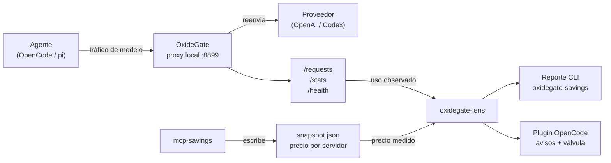
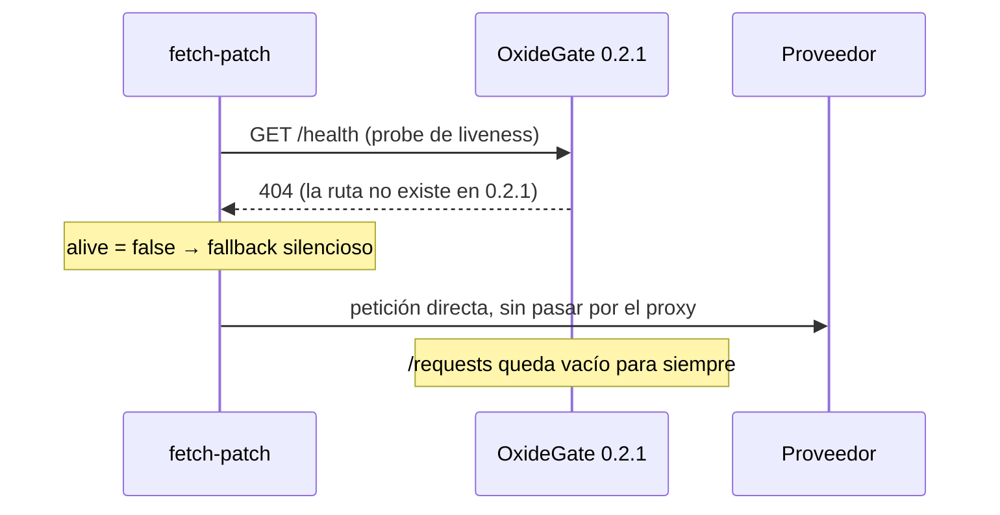
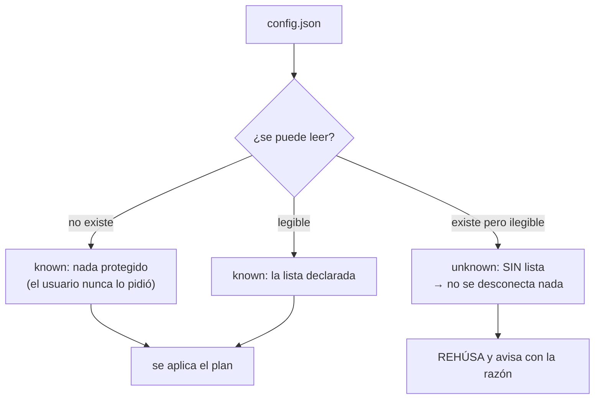

# Informe: la válvula MCP informada

| | |
|---|---|
| **Fecha** | 25 de julio de 2026 |
| **Repositorio** | `oxidegate-lens` — `main` en `62b7de9` |
| **Versiones** | oxidegate-lens 0.3.0 · OxideGate 0.3.1 · OpenCode 1.18.5 |

> Todas las cifras de este documento están **medidas**, no estimadas. Cada una
> procede de una ejecución real contra un OxideGate corriendo, del snapshot que
> escribe `mcp-savings` en disco, o de la suite de tests. Donde algo no se pudo
> medir, se dice.

---

## 1. Resumen ejecutivo

Se construyó una **válvula MCP informada**: una herramienta que dice cuánto
cuesta cada servidor MCP en el cable y si desconectarlo es defendible.

Tres resultados, por orden de importancia:

1. **Funciona la mitad que mide el precio.** Sabemos, por servidor y con
   exactitud, cuántos bytes de esquema viajan.
2. **No puede funcionar la mitad que mide el uso** en los dialectos que
   usas — y eso se descubrió midiendo, no razonando.
3. **El monitor llevaba vacío desde siempre por un paquete desactualizado**,
   no por un fallo de código.

El punto 2 es el hallazgo del trabajo y acota el producto. El punto 3 es la
razón por la que nada de esto se había podido comprobar antes.

---

## 2. Arquitectura



**Dos instrumentos independientes.** El precio viene de `mcp-savings`, que
mide los esquemas. El uso viene de OxideGate, que observa el cable. La lens
no mide nada: **une** ambos y se niega a concluir cuando no puede.

Esa separación es lo que hace posible la honestidad del sistema: cuando los
dos instrumentos no se corresponden, hay una tercera respuesta posible además
de "sí" y "no", que es **"no lo sé"**.

### Módulos

| Módulo | Responsabilidad | Puro |
|---|---|---|
| `lib/mcp-snapshot.mjs` | Lee el precio del snapshot | ✅ |
| `lib/mcp-usage.mjs` | Observa el uso en el cable | ✅ |
| `lib/mcp-valve.mjs` | Une precio × uso → recomendación | ✅ |
| `lib/mcp-protection.mjs` | Qué está protegido y qué se puede tocar | ✅ |
| `lib/mcp-transitions.mjs` | Diff entre dos lecturas de estado | ✅ |
| `lib/mcp-notices.mjs` | Los mensajes que lee el usuario | ✅ |
| `bin/oxidegate-savings.mjs` | Reporte por terminal | — |
| `opencode/oxidegate-lens.ts` | Adaptador fino sobre `lib/` | — |

**Decisión de diseño 1:** el plugin es TypeScript y no se puede ejecutar con
el runner del repo (`node --test` sobre `.mjs`). Por eso **toda la lógica vive
en `lib/`**, que sí es testeable, y el plugin solo cablea. Los tests estáticos
fallan si esa lógica empieza a filtrarse de vuelta al plugin.

---

## 3. La cadena que estaba rota

El monitor no mostraba nada. La causa resultó no ser código, sino **un paquete
desactualizado**, y estuvo escondida detrás de un fallo silencioso por diseño.



`/health` **existe desde OxideGate 0.3.0** — verificado por conteo:
`git show v0.2.1:src/main.rs | grep -c /health` → **0**; contra `v0.3.0` → **2**.
El código nunca faltó. Faltaba publicar el release: el tap de Homebrew servía
0.2.1 mientras el repo iba por 0.3.0.

**Por qué costó tanto verlo:** el fallback es silencioso *a propósito* — el
comentario del patch dice *"the pre-flight probe is what makes the fallback
safe"*. Degrada a tráfico directo sin error y sin log. Y nada en la cadena
reporta un desajuste de versión.

> **Lección general:** un *pin* de paquete obsoleto es invisible de una forma
> en la que una función ausente no lo es. El código fuente tiene el arreglo,
> los tests pasan, el tag existe — y el usuario sigue ejecutando algo de hace
> meses. Comprueba qué está **instalado** antes de concluir que algo no está
> implementado.

### El segundo fallo: token correcto, puerta equivocada

Una vez arreglado el probe, apareció otro error que parecía de permisos:

```
Missing scopes: api.responses.write
```

No era un problema de permisos. OxideGate expone **dos** rutas Responses que
reenvían a sitios distintos, y el fetch-patch apuntaba a la equivocada:

| Ruta | Reenvía a | Credencial que espera |
|---|---|---|
| `/v1/responses` | `api.openai.com` | API key con scopes |
| `/v1/codex/responses` | `chatgpt.com/backend-api/codex` | OAuth de suscripción |

El patch capturaba tráfico de Codex (OAuth) y lo entregaba a la API de pago
por token. Evidencia medida, antes y después de cambiar una línea:

```
ANTES  /v1/responses      → openai   14 peticiones   500×10  503×2  401×2
DESPUÉS /v1/codex/responses → codex    6 peticiones   200×6
```

> **Lección general:** un error de autenticación puede ser un error de
> enrutado. Comprueba a qué upstream reenvió el proxy antes de creerte un
> mensaje de permisos.

---

## 4. El hallazgo principal: `tools_flattened`

Con el tráfico entrando por fin, la primera ejecución real contra el cable
reveló el límite del producto.

En la ruta `/v1/responses` (y también en `/v1/codex/responses`, mismo
dialecto), **OpenCode aplana todas las tools en un único bloque sin
atribución**:

```json
{
  "tools_by_server": [{ "server": "(native)", "kind": "native", "tools": 40 }],
  "tools_flattened": true,
  "context_tools_bytes": 48172
}
```

Las tools MCP **están en el cable** — son parte de esas 40 — pero nada dice de
qué servidor viene cada una.

### La prueba de que las MCP están dentro

Al conectar y desconectar servidores MCP, el conteo y el peso del bloque
`(native)` se mueven juntos, sin que aparezca jamás un segundo servidor:

```
tools   bytes    bloque reportado
  34    39985    (native)   ████████████████████████████████
  35    42116    (native)   ██████████████████████████████████
  40    48172    (native)   ███████████████████████████████████████
```

Tres estados del mismo sistema, medidos en la misma sesión. El cable las
transporta; el dialecto no las distingue.

### Consecuencia para el producto

| Mitad de la válvula | Estado |
|---|---|
| **Precio** — cuánto cuesta cada servidor | ✅ Funciona |
| **Uso** — cuántas veces se usó cada servidor | ❌ Imposible en rutas que aplanan |

Esto **no es un bug**. Es el dominio de aplicación real, y era imposible
conocerlo sin llegar a medir.

### El error que casi se envía

La lens no conocía el campo, así que caía en `insufficient-observation`, cuya
acción implícita es **esperar**. En una ruta que aplana, esperar no sirve
nunca. El usuario habría acumulado tráfico indefinidamente esperando una
respuesta que no puede llegar.

Corregido: `tools-flattened` **gana** a `insufficient-observation`, porque uno
es permanente y el otro transitorio.

Y hubo un segundo defecto, más sutil, que solo se vio leyendo la salida real:
bloquear la recomendación **no bastaba**, porque la fila seguía imprimiendo
`0 usos`. Con las tools aplanadas ese cero deja de significar *"no se usó"* y
pasa a significar *"no se pudo saber"*.

> **Lección general:** la invariante de honestidad puede sostenerse en la
> **decisión** y romperse en el **render**. Hay que comprobar las dos capas.

---

## 5. Los precios medidos

Datos del snapshot de `mcp-savings` del 2026-07-25T09:53:14Z (fresco):

| Servidor | Bytes de esquema | Tokens | Peso relativo |
|---|---:|---:|---|
| `engram` | 17 233 | 3 788 | `████████████████████████` 79 % |
| `context7` | 4 577 | 977 | `██████` 21 % |
| **Total MCP** | **21 810** | **4 765** | |

Puestos en contexto contra lo que realmente viaja en cada petición:

```
Esquemas de tools por petición (bytes)

  OpenCode /v1/responses    48 172   ████████████████████████
  pi / Codex                72 570   ████████████████████████████████████
  ── de los cuales MCP ──   21 810   ██████████ (medible, pero no atribuible en el cable)
```

**Dato que conviene mirar dos veces:** `pi` gasta **72,5 kB de esquemas
nativos por petición** — más del triple que todo el MCP junto. En `pi`, la
pregunta interesante no es *"qué MCP desconecto"* sino *"por qué viajan 72 kB
de tools nativas en cada llamada"*.

### Medición de `pi`

7 peticiones reales capturadas en la telemetría. Todas idénticas en forma:

```
tools_by_server = ["(native):native"]     ← en las 7, sin excepción
context_tools_bytes = 72570
```

Cero servidores MCP en el cable, igual que OpenCode.

---

## 6. Las invariantes de honestidad

Este es el eje del diseño, y lo que hace que la herramienta sea confiable.

### 6.1 Una ausencia nunca es un cero

Rige todos los módulos. Un servidor que no se pudo medir se renderiza como
`desconocido`, jamás como `0`. La razón es concreta: **un cero fabricado es lo
que hace que una herramienta recomiende desconectar algo que estás usando.**

El caso que lo demuestra: `mcp-savings` construye `bytes` como suma de una
lista de tools. Cuando un servidor falla al conectar, esa lista está vacía, y
`bytes` sale **presente, numérico y `0`** — un campo real con un número sin
significado. Solo el flag `ok` distingue un cero real (`ok: true, bytes: 0`,
un servidor sin tools) de uno inmedible (`ok: false, bytes: 0`).

### 6.2 La misma regla, apuntando al revés

En la configuración de protección la invariante se invierte, porque ahí el
"cero" no es una cifra en un informe: **es una orden**.

> Una lista de protegidos vacía significa "desconecta todo".

Un lector que degradara un JSON roto a `[]` desconectaría exactamente los
servidores que ese fichero existía para proteger. Por eso un fichero
ilegible devuelve `status: 'unknown'` y **no lleva array alguno** — no puede
haber nada que un llamador descuidado pueda iterar.



### 6.3 Una ventana de observación siempre acompaña a su cifra

Ningún `0 usos` ni `candidato a desconectar` se imprime sin la ventana
observada **en la misma línea**. Hay un assert a nivel de render que lo
prohíbe.

### 6.4 Una lista parcial es peor que una admitida

Si la lista de protegidos trae `["engram", 42, "context7"]`, se podría filtrar
el `42`. **No se hace.** Una lista filtrada parece completa al llamador, que
no tiene forma de distinguirla de una intacta — y la entrada descartada es un
servidor que luego se desconecta.

---

## 7. Qué está verificado y qué no

Distinción deliberada. Un "verificado" general sería tan falso como un "no
verificado" general.

### Verificado contra sistemas reales

| Comprobación | Cómo |
|---|---|
| `client.mcp.status` | Sesión OpenCode 1.18.4 real |
| `client.mcp.disconnect` | Idem — deja el servidor en `"disabled"` |
| `client.mcp.connect` | Idem — restaura a `"connected"` |
| Aviso de arranque | Toast real: *"empiezas con 1 MCP sin conectar: context7"* |
| Protección de servidores | El toast dijo **1**, no 2 — `engram` sobrevivió |
| `session.idle` dispara | Conexión manual → aviso en el siguiente reposo |
| Silencio sin cambios | Los reposos vacíos no produjeron ningún aviso |
| Pipeline completo | Ejecutado contra snapshot real y `/requests` real |
| Interruptor en config | Plugin conducido **sin ninguna variable de entorno** |

**Detalle que solo aparece ejecutando:** tras un `disconnect`, el SDK devuelve
el estado **`"disabled"`**, no `"disconnected"`. El plugin sobrevive a eso
únicamente porque pasa el estado **verbatim** y nunca lo compara contra una
cadena fija.

### No verificado

| Qué | Por qué importa |
|---|---|
| Hook `tool.execute.after` | Solo ejercitado con cliente falso: prueba que el cableado corre, no que OpenCode lo dispare |
| Mitad *uso* de la válvula | Nunca ha podido ejercitarse: todas las rutas medidas aplanan |

---

## 8. Estado del código

### Tests

**164 tests, 0 fallos.** Distribución:

```
oxidegate-savings.test.mjs    32  ████████████████
mcp-valve.test.mjs            25  ████████████
mcp-protection.test.mjs       21  ██████████
mcp-usage.test.mjs            17  ████████
mcp-notices.test.mjs          16  ████████
mcp-snapshot.test.mjs         11  █████
mcp-transitions.test.mjs      10  █████
plugin-tools.test.mjs         10  █████
sdk-response.test.mjs         10  █████
mcp-config.test.mjs            9  ████
mcp-valve-topology.test.mjs    3  █
```

### Prueba de mutación

Norma de la casa: **un test que no puede fallar es decoración.** Cada
invariante crítica se sometió a una mutación que debía matarla:

| Mutación aplicada | Test que murió |
|---|---|
| Quitar la guarda de colisión del recomendador | CLI `name-collision` |
| Colapsar la colisión a su primera entrada | CLI `name-collision` |
| Degradar config rota a lista vacía | `malformed_json_is_unknown` |
| Filtrar entradas no-string en vez de rechazar | `non-string entries` |
| `unknown` de protección → "nada protegido" | `planMcpDisable refuses` |
| Primera lectura como comparación contra vacío | `first reading is baseline` |
| Servidor que aparece contado como conexión | `APPEARED is not connected` |
| Emitir aviso sin que nada se moviera | regla del silencio |
| Permitir el `0` con tools aplanadas | `uses es undefined` |
| Quitar la precedencia del aplanado | `flattened outranks` |
| Coercer el interruptor en vez de exigir boolean | `non-boolean is UNKNOWN` |
| Override que solo puede encender | `env can also turn it OFF` |

Doce mutaciones, cada una mató **exactamente** su test y ningún otro.

### Commits

19 commits, cada uno una unidad de trabajo verificada en verde por separado.

---

## 9. Configuración

Todo en un solo fichero, `~/.config/oxidegate-lens/config.json`:

```json
{
  "disableByDefault": true,
  "protectedMcpServers": ["engram"]
}
```

Al abrir OpenCode:

```
empiezas con 1 MCP sin conectar: context7 (4.6 kB). Siguen activos: engram (17.2 kB).
Para volver a abrir alguno: oxidegate_lens_mcp_connect. Detalle completo: oxidegate_lens_mcp_valve.
```

**Ver** el estado, **medir** el coste y **saber cómo revertirlo**, sin
ejecutar ningún comando.

### Por qué el interruptor no vive en una variable de entorno

Estuvo en `OXIDEGATE_MCP_DISABLE_BY_DEFAULT` y falló una prueba real: **el
propio autor abrió OpenCode sin exportarla**, con las instrucciones delante, y
la función simplemente no corrió — sin ninguna pista de que estaba apagada.

Un interruptor que hay que recordar exportar antes de arrancar un proceso está
apagado la mayor parte del tiempo. Y dejaba la configuración incoherente: la
lista en un fichero, el interruptor en el entorno. Dos mecanismos para una
sola función.

Las dos variables siguen funcionando y **ganan** cuando están definidas, en
**ambas direcciones** — un override que solo puede encender no es un override.

---

## 10. Lo que queda abierto

| # | Asunto | Naturaleza |
|---|---|---|
| 1 | La matriz de harnesses pregunta *"¿es medible?"*, que ya no es la pregunta que decide. Falta la columna **"¿conserva atribución?"** | Documentación |
| 2 | La fila de `pi.dev` dice *"Probable (pendiente)"* de medir, cuando hay 7 peticiones reales capturadas | Documentación desactualizada |
| 3 | El fetch-patch solo reescribe la URL **exacta** de Codex. Cualquier modelo no-Codex no pasa por el proxy | Producto |
| 4 | Ese patch no se distribuye: está escrito a mano en la máquina del mantenedor | Producto |
| 5 | Hook `tool.execute.after` sin verificar contra OpenCode real | Verificación |
| 6 | Fase 5 en `mcp-savings`: `saveSnapshot` atómico y retirar `panel.ts` | Otro repositorio |

### La pregunta de producto que sale de todo esto

La válvula informada se diseñó para responder *"¿qué MCP puedo desconectar
porque no lo uso?"*. Medido: **esa pregunta no se puede responder en los
dialectos que usas hoy**, porque el cable no conserva la atribución.

Lo que sí se puede responder, y con precisión:

- **Cuánto cuesta cada servidor MCP** (medido, por servidor).
- **Cuánto cuesta el conjunto de tools nativas** — que en `pi` es 3,3 veces
  mayor que todo el MCP junto.
- **Qué está conectado ahora mismo y qué se desconectó al arrancar.**

Esa segunda línea puede ser la más valiosa y no estaba en el diseño original.

---

*Documento generado a partir de mediciones reales del 25 de julio de 2026.
Ninguna cifra es estimada.*

---

## Cómo se regenera este documento

El PDF no es un binario huérfano: se genera del `.md` que tienes al lado.

```sh
node scripts/informe-a-html.mjs docs/INFORME-VALVULA-MCP.md /tmp/informe.html
google-chrome --headless --disable-gpu --no-sandbox \
  --print-to-pdf=docs/INFORME-VALVULA-MCP.pdf --no-pdf-header-footer /tmp/informe.html
```

`scripts/informe-a-html.mjs` es un conversor acotado al subconjunto de
Markdown que usa este informe, sin dependencias. Los diagramas Mermaid del
`.md` (que GitHub renderiza solo) se sustituyen por **SVG embebido** en el
HTML, porque no hay `mermaid-cli` instalado y un Chrome headless sin red no
traería un CDN. Los dos formatos muestran los mismos diagramas por caminos
distintos.
