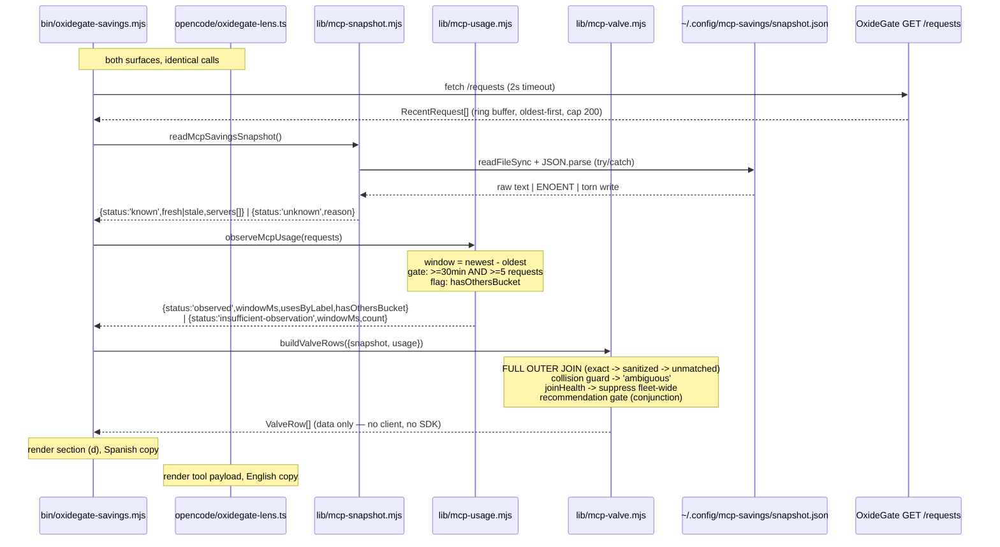

# Design — Informed MCP valve: architecture and mechanism

## Technical approach

All logic lands in **`lib/`, as plain ESM `.mjs`, as pure functions of data
already fetched** — three new modules (`mcp-snapshot.mjs`, `mcp-usage.mjs`,
`mcp-valve.mjs`). Both surfaces (`bin/oxidegate-savings.mjs` and
`opencode/oxidegate-lens.ts`) become thin adapters that fetch, call, and render.
Nothing in `lib/` performs I/O beyond one `readFileSync` of a file path handed
to it.

Three mechanisms carry the change:

1. **The join is a FULL OUTER JOIN over sanitized server names**, never an inner
   join. A server present on either side always produces a row. A dropped server
   is the failure mode this design is built to make structurally impossible.
2. **The observation window is DERIVED from the timestamps OxideGate returns**,
   never assumed by lens — plus a two-part sufficiency gate that makes a
   freshly-started proxy emit *no* recommendation rather than "disable
   everything".
3. **Recommendation data has no code path to a mutation call site.** The
   valve's honesty invariant is enforced by module topology, not by discipline.

Every degradation is expressed as a **tagged union**, reusing the
`{ status: 'known' | 'unknown', reason }` idiom `lib/mcp-config.mjs` already
established. That idiom exists in this repo for exactly this reason: it makes
"I could not read this" impossible to accidentally render as zero.

## What the code already tells us (verified, not assumed)

| Fact | Source | Consequence for this design |
|------|--------|------------------------------|
| `snapshot.timestamp` is Unix epoch **milliseconds** | `mcp-savings/packages/core/src/types.ts:70` | Staleness is `Date.now() - timestamp`. No date parsing. |
| `mcpMeasurement[].server` is the **host's configured name**, unsanitized | `types.ts:31`, `measure.ts:40` | It does NOT match the wire label directly. The join needs a transform. |
| `tools_by_server[].server` is the **sanitized wire label** | `lib/mcp-config.mjs` header, OxideGate `src/provider/mod.rs` | `sanitizeServerName` is the transform — lens already owns it. |
| `saveSnapshot` is a bare `writeFileSync`, **not atomic** | `mcp-savings/packages/core/src/config.ts:79-83` | Torn reads are structurally possible. Defensive parsing is not paranoia; it is required. |
| `ServerMeasurement.tokens` is `null` if **any** tool's tokens is `null` | `measure.ts:55-62` | `null` is a whole-server property. Never summed past. |
| `ok: false` yields `bytes: 0` (sum of an empty tool list) | `measure.ts:102+` | **A real zero that is not a zero.** See Decision 4. |
| `/requests` is a FIFO ring buffer, `RECENT_CAPACITY = 200` | OxideGate `src/telemetry/recent.rs:53` | The derived window is bounded by the buffer — it **understates**, never overstates. |
| `RecentRequest.timestamp` is an RFC 3339 **string** | `recent.rs:67-68` | Window arithmetic needs `Date.parse`, with an unparseable-row guard. |
| Only `MAX_TOOL_SERVERS` (32) servers get individual rows; the rest collapse into `(others)` | `bin/oxidegate-savings.mjs:420-434` | "0 uses" is **unconfirmable** whenever an `(others)` row is present. Precedent already handled. |

## Architecture decisions

### Decision 1: all logic in `lib/*.mjs`; the plugin is a thin adapter

**Choice.** Three new pure modules in `lib/`, imported by *both*
`bin/oxidegate-savings.mjs` (existing relative-import precedent:
`import { readDeclaredMcpServers } from '../lib/mcp-config.mjs'`) and
`opencode/oxidegate-lens.ts` (new relative import `../lib/mcp-valve.mjs`).

**Alternatives rejected.**

1. *Logic in the plugin, CLI reimplements it.* Two copies of the honesty rules,
   drifting. Rejected outright.
2. *Logic in a new `.ts` module shared by both.* The CLI is `.mjs` run by bare
   `node` with no build step. Adding a compile step to a zero-dependency repo to
   share a file is a large structural cost for no gain.

**Justification (decisive factor: the test runner).** `node --test
test/*.test.mjs` **cannot reach `opencode/oxidegate-lens.ts` at all** — not the
glob, not the loader. Any logic placed in the plugin is, by construction,
untestable under this project's only test command. With Strict TDD active, that
is not a tradeoff; it is a wall. Every rule that can be got wrong (the join, the
window, `null` handling, the recommendation gate) must therefore live in `lib/`.

What is left in the plugin is what cannot be tested anyway: SDK calls and
rendering. That is the correct residue.

**Accepted cost.** `opencode/oxidegate-lens.ts` imports a `.mjs` file. Bun (the
OpenCode plugin loader) resolves plain relative ESM without ceremony, and both
`lib` and `opencode` already ship in `package.json#files`. There is no
type-checker in this repo (`config.yaml` → `type_checker: "—"`), so the untyped
import costs nothing that is currently being paid.

### Decision 2: the observation window is DERIVED from the data, never assumed

**Choice.** `observeMcpUsage(requests)` computes the window as
`newest.timestamp − oldest.timestamp` **across the rows OxideGate actually
returned**, restricted to rows where `tools_by_server` is an array.

**Alternatives rejected.**

1. *Fixed wall-clock window (e.g. "last 3h"), filtering `/requests` by it.*
   Rejected — **this is the deferred open question, and it resolves against the
   fixed window.** Saying "0 uses in the last 3h" requires asserting OxideGate
   was up and observing for those three hours. Lens cannot verify that; the
   payload does not contain it. If the proxy started ten minutes ago, the
   sentence is simply false for 2h50m of its own claim. That is a statement
   about the world, and this repo's entire history (seven review rounds, per the
   `bin/` header) is the story of removing statements about the world from a
   presentation layer.
2. *Ask OxideGate for its uptime.* No such endpoint, and it would make lens
   depend on a new proxy field. Out of scope.

**Justification.** `newest − oldest` is a fact *derivable from the payload
alone*. It needs no assumption about uptime, no clock agreement between two
processes, and no new endpoint. The label it produces —
`"0 uses in the last 3h observed"` — is verifiable against the same bytes lens
read.

**The truncation cuts the safe way.** At `RECENT_CAPACITY = 200` the buffer has
evicted older history, so the derived window is *shorter* than the real
observation period. A shorter window makes "0 uses" a **weaker** claim, which
weakens a recommendation to turn something off. For a rule whose failure mode is
"advised the user to disable something they need", understating is the correct
direction to be wrong in.

**Rows excluded from the window.** A row whose `tools_by_server` is absent or
`null` (an OxideGate build predating the field) is **not evidence of absence** —
it cannot distinguish "server X did not arrive" from "this build does not
report". Such rows are dropped from the window entirely, mirroring the
`CTX_UNKNOWN` discipline already in `bin/oxidegate-savings.mjs:263`. A row with
an *empty* `tools_by_server` array **is** included: it is a real observation
that a request declared no tools.

### Decision 3: a two-part sufficiency gate — a fresh proxy recommends nothing

**Choice.** `observeMcpUsage` returns `{ status: 'insufficient-observation' }`
unless **both** hold:

| Gate | Threshold | The failure it exists to kill |
|------|-----------|-------------------------------|
| Window duration | `>= 30 min` | 200 requests fired in 90 seconds. Plenty of data, no *time* observed. A server used hourly reads as unused. |
| Request count | `>= 5` | The proxy was up for four hours and saw two requests. Plenty of time, no *evidence*. |

**Alternatives rejected.**

1. *Duration only.* Fails the burst case above.
2. *Count only.* Fails the idle case above.
3. *No gate; let the window label speak for itself.* "0 uses in the last 40
   seconds" is technically honest and practically an invitation to disable
   everything on a machine that just booted. The label is not enough; the rule
   must not fire.

**Justification.** The two gates fail in orthogonal directions, so neither alone
is sufficient. Both together are the minimum that makes "0 uses" carry any
information. Under `insufficient-observation`, **no server gets a
recommendation** — the surface states what was observed
(`"12 min, 3 requests — not enough to judge yet"`) and stops. That is the
concrete mechanism that stops a freshly-started OxideGate from recommending
disabling everything.

These are thresholds, not truths. They are named constants with the reasoning
above in their doc comments, so a future change argues with the reasoning rather
than the number.

### Decision 4: `ok: false` is price-UNKNOWN, never `bytes: 0`

**Choice.** `readMcpSavingsSnapshot` maps `mcpMeasurement[].ok === false` to
`price: null`, discarding its `bytes` field entirely.

**Justification.** `measure.ts` builds `bytes` as the sum of a tool list that is
**empty** when the connect/list failed. The field is therefore *present, typed,
`0`, and meaningless*. The spec's "REQUIRED: `.bytes`" rule is satisfied by the
letter and violated in spirit: rendering it would print "this server costs 0
bytes" about a server whose cost is unknown — precisely the `null`-coerced-to-`0`
lie the proposal forbids, arriving through the one door the field-presence check
does not guard.

mcp-savings' own panel already draws this line
(`panel.ts:88-91`: *"an errored server has no measured tokens to add… silently
treating it as 0 would claim a precision we don't have"*). Lens matches it.

### Decision 5: FULL OUTER JOIN on sanitized names, with a three-tier match

**Choice.** `buildValveRows({ snapshot, usage })` emits one row per server in
the **union** of both sides. Match tiers, tried in order:

| Tier | Rule | Row provenance |
|------|------|----------------|
| 1 | `snapshot.server === wireLabel` | `join: 'exact'` |
| 2 | `sanitizeServerName(snapshot.server) === wireLabel` | `join: 'sanitized'` |
| 3 | no match either way | `join: 'snapshot-only'` or `'wire-only'` |

**Ambiguity guard.** `sanitizeServerName` is **not injective** (`"foo bar"` and
`"foo_bar"` both → `"foo_bar"`). If two snapshot names collapse to one wire
label, **neither joins**; both render `join: 'ambiguous'` and are ineligible for
any recommendation. This is a direct reuse of `declaredVsArrived`'s existing
`collisions` handling (`bin/oxidegate-savings.mjs:233-241`) — the same lossy
transform, so the same honest answer.

**Alternatives rejected.**

1. *Inner join.* Drops every priced-but-off server — i.e. **the entire feature**.
2. *Sanitized-only match (skip tier 1).* Works, but silently claims a transform
   was needed when it was not. Tier 1 makes the common case (`"engram"`,
   `"github"` — names needing no sanitizing) an exact identity, and reserves the
   `'sanitized'` provenance label for rows where lens really did guess.
3. *Fuzzy/prefix matching.* mcp-savings' own attribution heuristic
   (`attribute.ts`) is marked UNVERIFIED in its own header. Building a second
   heuristic on top of the first compounds two unverified guesses into one
   confident-looking number. Refused.

### Decision 6: the name-mismatch risk is structurally identical to "0 uses" — and `joinHealth` is the guard

**The finding.** These two statements select the *same* rows:

- "server X was measured but never appeared on the wire in this window"
- "server X's name in the snapshot does not correspond to its label on the wire"

Both produce `join: 'snapshot-only'`. A per-row rule cannot tell them apart —
there is no third field to break the tie. So the disambiguation must be made at
the **fleet** level, not the row level.

**Mechanism — `joinHealth`.** Before any recommendation is emitted,
`buildValveRows` computes whether the two instruments demonstrably agree *at
all*:

```
matchedCount = snapshot servers that matched >= 1 wire label in the window
wireMcpCount = distinct mcp-kind labels observed in the window

if (wireMcpCount > 0 && matchedCount === 0)
  -> joinHealth = 'no-correspondence'
  -> SUPPRESS EVERY recommendation, fleet-wide
  -> render: "measured servers could not be matched to any wire traffic —
     the two tools may not name servers the same way"
```

This is the single highest-value rule in the design. The catastrophic outcome —
a naming bug causing lens to recommend disabling *the user's entire fleet* — has
exactly one signature, and it is the signature `joinHealth` detects: the wire is
busy with MCP traffic while the snapshot matches none of it. A real "everything
is unused" fleet does not look like that; it looks like `wireMcpCount === 0`,
which is handled by the sufficiency gate and by having nothing to recommend
against.

When `matchedCount > 0`, the transform is demonstrably working *for this
harness*, and an unmatched `enabled !== false` server is reported as the fact it
is: no tools attributable to that name arrived in the window. No cause is
attached — consistent with section (b) of `bin/oxidegate-savings.mjs`, which
names the same subtraction and refuses to explain it.

**Residual risk, stated.** A *partial* naming mismatch (some servers match, one
does not, and that one is genuinely in use under a different label) survives
this guard and would be labeled a disable candidate. It is mitigated, not
eliminated, by three properties: the valve never acts, the window is always
stated, and `enabled: false` servers — the overwhelming majority of unmatched
rows in practice — take the branch below instead.

### Decision 7: the recommendation gate is a conjunction of named refusals

`recommendationFor(row, usage, joinHealth)` emits `'candidate-to-disable'`
**only if every one of these holds**:

| Gate | Otherwise → reason |
|------|--------------------|
| `usage.status === 'observed'` | `'insufficient-observation'` |
| `joinHealth !== 'no-correspondence'` | `'instruments-disagree'` |
| no `(others)` bucket in the window | `'not-individually-confirmed'` |
| `row.join !== 'ambiguous'` | `'name-collision'` |
| the server is currently ON (`enabled !== false`) | `'already-off'` |
| `uses === 0` across the window | *(no recommendation needed)* |

Each refusal has a **name**, and each name renders as its own sentence. There is
no `null` recommendation that renders as blank — "I am not recommending, and
here is why" is a first-class output, not an absence.

**The `'already-off'` branch is the feature's headline.** A server with
`enabled: false` in the snapshot is priced and legitimately absent from the wire
(of course it sent nothing — it is off). Labeling it "candidate to disable"
would be absurd. Instead it renders the counterfactual the wire structurally
cannot know:

> `off — costs 17.2 kB / 3788 tok per request if you turn it on`

That row is the number that does not exist on the wire, on the surface where the
decision is made. It is the whole point of the change.

### Decision 8: the honesty invariant is enforced by module topology

**Choice.** `lib/mcp-valve.mjs` has **no import path — direct or transitive — to
any call site of `client.mcp.connect` / `client.mcp.disconnect`.** It imports
`lib/mcp-snapshot.mjs`, `lib/mcp-usage.mjs`, and `sanitizeServerName`. It
exports data. It receives no `client`.

**Justification.** "Informs, never acts" is a property this design can either
document and hope for, or make **structurally unreachable**. Recommendation data
flows in exactly one direction: `lib/` → render. There is no wire from the
recommendation to the SDK, so no future edit can accidentally connect one
without visibly creating a new dependency edge and defeating the header comment
that says why it must not exist.

**A conflict this decision surfaces (see Open questions).**
`opencode/oxidegate-lens.ts:311` currently calls
`void disableMcpServersByDefault(client, directory)` at plugin load — which
**auto-disconnects MCP servers in the background**, gated on
`OXIDEGATE_MCP_DISABLE_BY_DEFAULT`. That sits in visible tension with the
proposal's "no auto-disable, no background mutation of the user's MCP config".

This design **does not remove it** (it predates this change and is not in
scope), and resolves the tension narrowly: it survives because it is a
**declarative human opt-in** — a human set an env var; lens executes a standing
instruction and decides nothing. What Decision 8 forbids is the thing that would
genuinely break the invariant: **the recommendation must never feed that
allowlist.** `disableMcpServersByDefault` reads `process.env` and
`client.mcp.status()`. It must never read a valve row. The topology rule makes
that edge impossible to add quietly.

### Decision 9: the tool names graduate; the caveat moves into the payload

| Today | After | Rationale |
|-------|-------|-----------|
| `oxidegate_lens_experimental_mcp_status` | **`oxidegate_lens_mcp_valve`** | Reshaped, not renamed. It stops dumping raw SDK status and returns the informed surface: price, usage, window, recommendation, reason. Read-only. |
| `oxidegate_lens_experimental_mcp_connect` | **`oxidegate_lens_mcp_connect`** | Name graduates. |
| `oxidegate_lens_experimental_mcp_disconnect` | **`oxidegate_lens_mcp_disconnect`** | Name graduates. |

**Justification.** The `EXPERIMENTAL` prefix was carrying two unrelated meanings
at once:

1. *"we have not verified the hook fires / the reads work"* — **now false.** The
   integration is live; the proposal's own correction (the routing comment) is
   the admission.
2. *"we do not promise `client.mcp.disconnect` mutates the outgoing tool list in
   the same session"* — **still true**, and already stated verbatim in
   `valveResult`'s `warning` field (`oxidegate-lens.ts:271-273`).

A tool *name* cannot carry a nuanced, still-true caveat; a payload field can,
and already does. So the name graduates and the caveat stays exactly where it is
precise. `valveResult`'s `experiment:` key becomes `caveat:`; the `warning`
string is preserved verbatim. Verifying claim (2) would require lens to
**measure** the effect — which is the one thing this repo does not do.

## Data flow



**One-way property.** The `VA -->> CLI` edge is the last one. No arrow leaves
`buildValveRows` toward `client.mcp.*`. That is Decision 8, drawn.

## Module boundaries

| Module | Exports | Owns | Never |
|--------|---------|------|-------|
| `lib/mcp-snapshot.mjs` (new) | `readMcpSavingsSnapshot({path?, now?})`, `resolveSnapshotPath()` | path resolution, `readFileSync`, defensive parse, staleness (24h per spec), `ok:false` → price `null`, `tokens: null` passthrough | fetch anything, know the wire exists |
| `lib/mcp-usage.mjs` (new) | `observeMcpUsage(requests, {now?})` | window derivation, sufficiency gate, per-label use counts, `(others)` detection, RFC 3339 parsing | read the filesystem, know the snapshot exists |
| `lib/mcp-valve.mjs` (new) | `buildValveRows({snapshot, usage})` | the join, collision guard, `joinHealth`, the recommendation conjunction | perform I/O, hold a `client`, format a string for a human |
| `lib/mcp-config.mjs` (existing) | `+` re-used `sanitizeServerName` | unchanged | — |
| `bin/oxidegate-savings.mjs` | — | fetching, **section (d)** rendering (Spanish, per repo convention) | contain a rule |
| `opencode/oxidegate-lens.ts` | — | SDK calls, tool payload rendering (English) | contain a rule |

Each new module gets a **CONTRACT-style header comment** in the established
house style (see `lib/mcp-config.mjs`): what it refuses to conclude, and why.
`mcp-valve.mjs`'s header carries Decision 6 in full — the mismatch/0-uses
identity is the one thing a future reader will not reconstruct from the code.

### Path resolution (and the duplication that is deliberate)

```
resolveSnapshotPath():
  process.env.OXIDEGATE_LENS_SNAPSHOT
  ?? join(homedir(), '.config', 'mcp-savings', 'snapshot.json')
```

This **duplicates** `mcp-savings/packages/core/src/config.ts::snapshotPath()` by
value. That duplication *is* the file contract — importing the function is the
runtime dependency `config.yaml` forbids. Note it does **not** honour
`XDG_CONFIG_HOME`, because mcp-savings does not either; matching the real writer
matters more than matching the spec everyone ignores. The env override exists
for hermetic tests and for users with a non-standard layout.

## Degradation matrix → mechanism

The spec defines the behavior; this is the code path that produces it.

| OxideGate | Snapshot | `usage.status` | `snapshot.status` | Rows produced |
|---|---|---|---|---|
| present | fresh | `observed` | `known/fresh` | joined + snapshot-only + wire-only. Full valve. |
| present | stale | `observed` | `known/stale` | same rows; every price tagged with `timestamp`. |
| present | missing/malformed | `observed` | `unknown` | wire-only rows. No price column. One-line install hint. |
| absent | fresh | `unavailable` | `known/fresh` | snapshot-only rows. Price shown, **no recommendation** (`'insufficient-observation'`). |
| absent | missing | `unavailable` | `unknown` | zero rows. Section (d) prints one line and stops. No throw. |

`OxideGate absent` reaches `observeMcpUsage` as an empty/failed fetch → the
sufficiency gate refuses on count. **The absent-proxy case needs no special
branch** — it is the sufficiency gate doing its job. That is the payoff of
Decision 3: one gate, two problems.

## Panel retirement sequencing

The forbidden state is **zero permanent surfaces**. Temporary *overlap* — two
surfaces at once — is fine, and is the ordering's safety margin.

| PR | Repo | Change | Permanent surfaces after |
|----|------|--------|--------------------------|
| **1** | oxidegate-lens | `lib/` modules + section (d) + graduated tools + kill the outdated routing comment | **2** (mcp-savings panel + lens valve) |
| **2** | mcp-savings | `saveSnapshot` → atomic write (`writeFileSync(tmp)` + `rename`) | 2 |
| **3** | mcp-savings | Retire the panel; keep `/saving` | **1** (lens valve) |

**PR 1 stands alone.** It requires no mcp-savings change whatsoever: with no
snapshot it degrades to today's wire-only behavior, which is exactly the current
product. That is what makes the ordering safe rather than merely stated.

**PR 2 is a contract, not an API.** `writeFileSync` to a temp path in the same
directory, then `rename` (atomic on the same filesystem). It closes the torn-read
window that `config.ts:82` leaves open today. It is **not a prerequisite** — lens
tolerates a torn read by design (Decision: defensive parse degrades to
`unknown`) — so this ordering only reduces flicker frequency. It ships second
because it is invisible and cheap, not because PR 1 depends on it.

**PR 3 is gated, and its diff is surgical.** `panel.ts` currently exports one
`tui` plugin that does **two** things: `api.slots.register({ sidebar_content })`
*and* `registerReportCommand(api)`. Retiring the panel must not retire `/saving`.

- Delete: `Panel`, `computeRows`, `renderRow`, `PanelRow`, the `api.slots.register`
  call, and the now-unused `@opentui/solid` / `solid-js` imports.
- Keep: the `tui` export, calling `registerReportCommand(api)` only. Rename
  `panel.ts` → `tui.ts`.
- **Merge gate (checklist, not vibes):** lens PR 1 published *and* the informed
  valve confirmed rendering in a live OpenCode session.

**Rollback stays safe at every point**, because at no PR boundary does the count
of permanent surfaces reach zero. Revert PR 3 → the panel returns; revert PR 1 →
the panel was still there.

## Testing strategy

| Layer | What | How |
|-------|------|-----|
| Unit — `mcp-snapshot` | missing file, malformed JSON, **torn/truncated JSON**, unknown shape, entry missing `bytes`, `ok:false` → price `null` (**not 0**), `tokens:null` passthrough, fresh vs. 30h stale | direct import; `path` and `now` injected |
| Unit — `mcp-usage` | window arithmetic; gate refuses at 29 min / at 4 requests; passes at both; `(others)` flag; rows with absent `tools_by_server` excluded; empty array **included**; unparseable RFC 3339 row | synthetic `RecentRequest[]` fixtures |
| Unit — `mcp-valve` | exact match, sanitized match, collision → `'ambiguous'`, snapshot-only, wire-only, **`joinHealth: 'no-correspondence'` suppresses fleet-wide**, `'already-off'` branch, every named refusal reason | pure fixtures, no I/O |
| CLI — real binary | section (d) end-to-end across the 5-row degradation matrix | extend `runSavingsCli` with a `homePath` option; new `test/helpers/fake-snapshot.mjs` writes into a tmp `HOME`. Stays hermetic — the helper already builds `env` from scratch |
| Regression guards | `assertNoUnwindowedRecommendation` (never "candidate to disable" without a window); `assertNoFabricatedZero` (never `0 tok` / `0 B` where the source was `null` or `ok:false`) | new shared asserts in `run-savings-cli.mjs`, alongside `assertNoDeadCausalArtifacts` |

**Why CLI-level tests carry real weight here.** `run-savings-cli.mjs`'s own
header records that all nine historical defects were *a wrong sentence printed
next to a true table* — and that unit-testing the internals in isolation would
have let every one through. The `0 uses` label is exactly that shape of bug. The
window must be tested **in the rendered string**, not just in the return value.

**The plugin remains untested**, by construction (Decision 1). That is the
explicit price of `node --test test/*.test.mjs` being the only runner, and it is
why the plugin is permitted to contain no rule.

## Open questions

- [ ] **`disableMcpServersByDefault` auto-disconnects at plugin load**
      (`oxidegate-lens.ts:311`), which sits in tension with the proposal's "no
      background mutation". Decision 8 keeps it (declarative human opt-in) and
      firewalls the recommendation away from it. **Needs a user ruling**: keep
      as-is, or retire in a follow-up? Does not block the architecture.
- [ ] **Port discrepancy.** The design brief cites OxideGate at `127.0.0.1:8899`;
      the code, `config.yaml`, and OxideGate's own default all say **8080**
      (`OXIDEGATE_PORT` overrides). This design assumes 8080. If 8899 is the real
      local setup, it is an env-var matter, not a code change — but the docs
      disagree with the brief and someone should say which is right.
- [ ] **Threshold values** (30 min / 5 requests) are judgment, not measurement.
      The *shape* of the gate is fixed here; the numbers are a task-time call and
      are trivially tunable as named constants.
